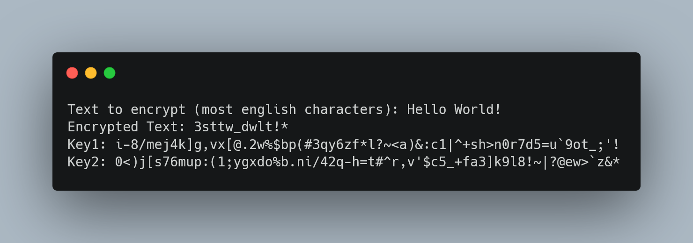

# TesohhCrypt

> TesohhCrypt is a zero-dependency Cryptography Python Module, with a method that i made.
### **2 Key System**
TesohhCrypt uses a 2 Key System. Each key has the same length and the same characters, but in different order.

These keys can be generated through TesohhCrypt.
#### tencrypt.py Fixed Key1
The Key1 can be set when encrypting a message, while the Key2 cannot (of course if you use the module for your program you can set the keys however you like)

### **How it works**
Let's say that we want to encrypt the text `Hello!`
1. TesohhEncrypt generates 2 keys (the keys are actually longer for security reasons, this is just an example):


2. TesohhEncrypt converts these 2 keys in a dictionary, where `Key1` characters are keys and `Key2` characters are values.
3. 
	* For encryption:
		* Use the converted key to write to `newText` the encrypted string
		* Encrypted Result: `prkk.m`
 	* For decryption:
	 	* Invert keys and values
		* Use the converted and inverted key to write to `newText` the plain text string

If you didn't already notice, this is the converted key:
```py
{
	"h": "p",
	"l": "k",
	"!": "m",
	"o": ".",
	"e": "r"
}
```
So it just does 
```py
for i in text:
	newText += key[i]
```
### **Documentation**
Documentation is coming.